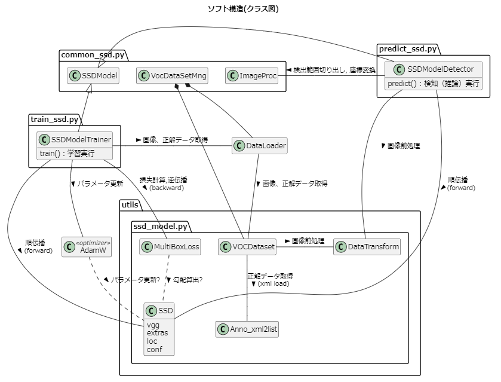
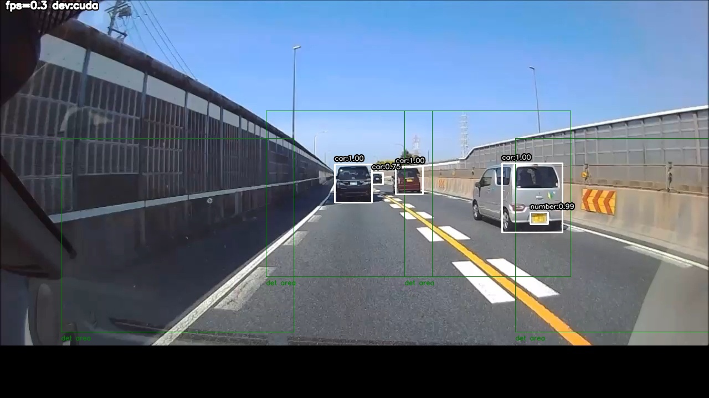
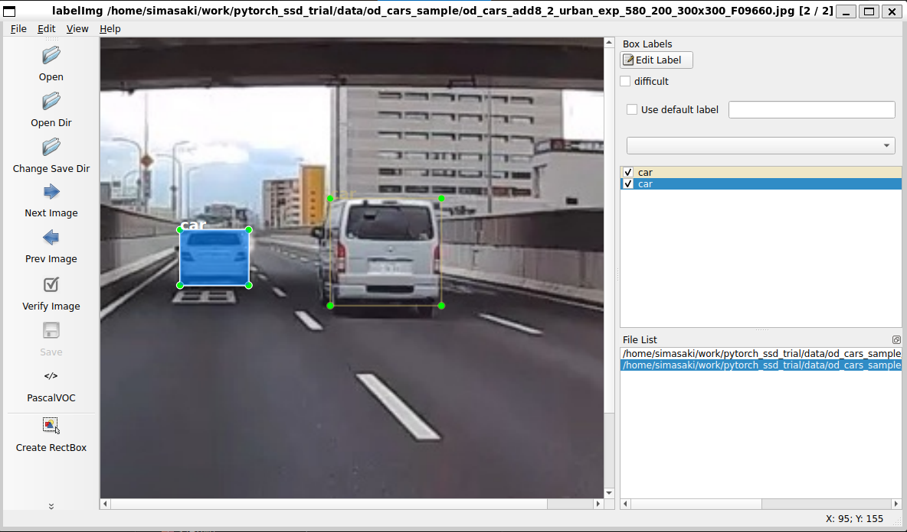
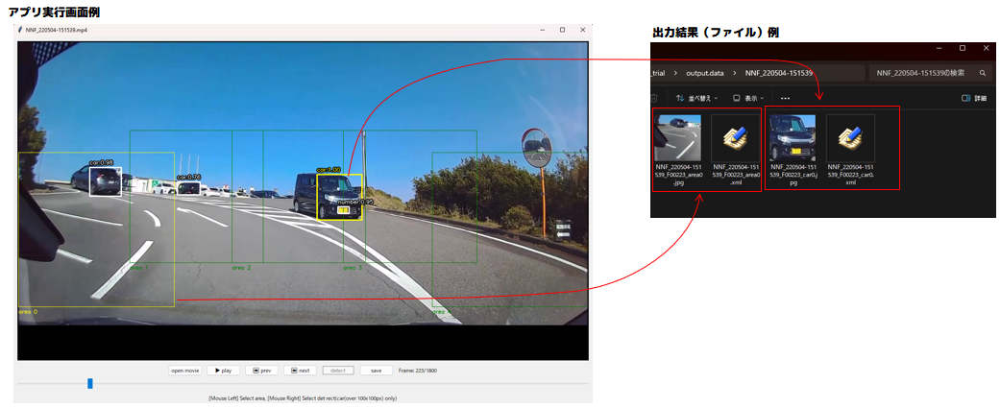
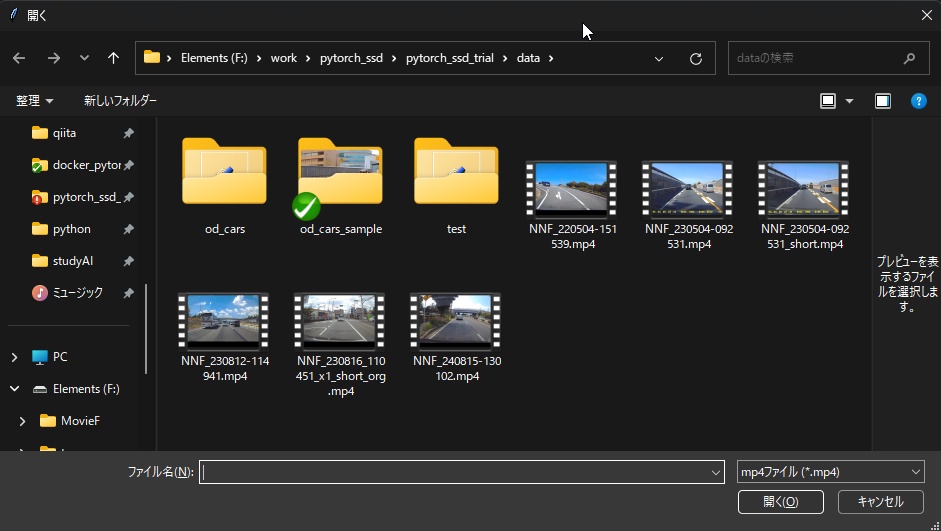
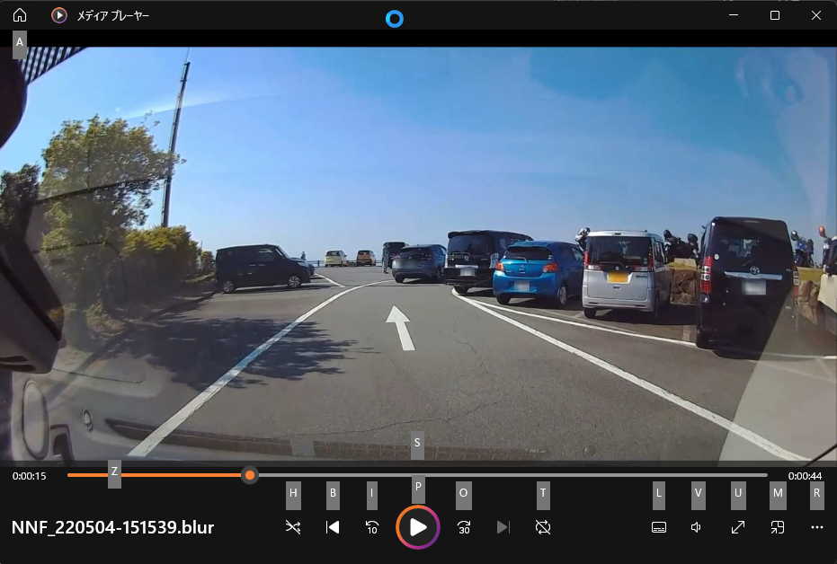

# pytorch_ssd_trial
pytorch ssdの転移学習を実行するソース一式です。

## ファイル構成

| ディレクトリ,ファイル | 説明 |
|---|---|
| utils/ | SSDモデル実装等のソース（モデルはVGG16ベースのSSD300）  |
| vision/ | SSDモデル実装等のソース（モデルはmobilenet-v2-liteベースのSSD300） |
| weights/ | パラメータファイル格納　※詳細は後述の表参照 |
| data/od_cars_org_F00000.jpg | テストデータ（推論用画像） |
| data/od_cars_sample/ | テストデータ（学習用画像、アノテーションデータのサンプル） |
| common_ssd.py | 推論/学習共通部分のソース |
| train_ssd.py | 学習実行ソース |
| predict_ssd.py | 検知（推論）実行ソース |
| train_image_extractor.py | 動画(mp4)から学習用画像切り出しツール(ソース) |
| app_carnumber_auto_blur.py | ナンバープレート自動ぼかしアプリ(ソース) |
| python_version.txt | 動作確認したpythonバージョン |
| python_module_version.txt | 動作確認したpythonモジュールのバージョン |

### weightsディレクトリ詳細
| weightsディレクトリ内のファイル | 説明 |
|---|---|
| vgg16-ssd_best_od_cars.pth | 学習済みSSD(VGG16ベース)パラメータデータ(車、ナンバープレートを学習済) |
| vgg16-ssd_best_od_cars_classes.txt | vgg16-ssd_best_od_cars.pthで学習したクラス名 |
| mb2-ssd_best_od_cars.pth | 学習済みSSD(mobilenet-v2-liteベース)パラメータデータ(車、ナンバープレートを学習済) |
| mb2-ssd_best_od_cars_classes.txt | mb2-ssd_best_od_cars.pthで学習したクラス名 |


utils、vision以下のSSDソースは、以下掲載ソースをベースに、上述のpythonバージョンで動作するよう一部修正したものです。
- utils  (VGG16ベースSSD)
  - https://github.com/hituji1012/od_test (Copyright (c) 2021 hituji1012)
- vision (mobilenet-v2-liteベースSSD)
  - https://github.com/qfgaohao/pytorch-ssd (Copyright (c) 2019 Hao Gao)


参考までに、ソースのクラス図です（主要クラスのみ。Debugクラス等は省略。VGG16ベースSSD）。


## 検知（推論）実行方法

ターミナルで以下を実行します。
```sh
# ubuntuターミナルの場合
./predict_ssd.py [動画(mp4) or 画像ファイルパス]

# Anaconda Powershell Promptの場合
python predict_ssd.py [動画(mp4) or 画像ファイルパス]
```

結果は、output.cuda or output.cpuディレクトリ以下に出力されます。

実行結果例
```sh
./predict_ssd.py data/od_cars_org_F00000.jpg
```


入力画像/動画の解像度は1280x800、検出対象は車＆ナンバープレートの想定で、predict_ssd.py末尾の以下コードで検出範囲を設定しています（車がいそうな領域を設定）。

異なる解像度の画像や、検出対象がいそうな領域が違う場合は、以下の検出範囲を適宜編集してご利用ください。現状、境界値チェックを入っておらず、はみ出すと落ちてしまうので、ご注意ください。

また、検知に使うSSDモデルをVGGベースにする場合は、以下ソースでコメントアウトされている「(SSDモデル:VGGベース)ネットワーク種別/パラメータ/バッチ処理数」の行を有効化（「(SSDモデル:mobilenetベース)...」はコメントアウト）します。

なお、下記にある```predictDetail()```は、２段階検出処理です。大きな物体（例：車、顔etc.）の中にある小さな物体（例：ナンバープレート、目etc.）の未検出を減らす効果が期待できますが、処理速度は低下します。無効化する場合は、```ssd_model_is_det_detail```を```False```に設定します。

```python
# predict_ssd.py抜粋（cfg）
cfg = {
    # 動画再生fps (負値＝入力動画のfpsそのまま)
    "play_fps"     : -1.0,

    # 検出範囲(1280x720、真ん中or右車線走行シーン、駐車場シーン用)
    "img_procs"    : [ImageProc(0, 250, 350, 600), 
                      ImageProc(250, 200, 550, 500), 
                      ImageProc(480, 200, 780, 500), 
                      ImageProc(730, 200, 1030, 500), 
                      ImageProc(930, 250, 1280, 600)],

    # 検出範囲(1280x720、左車線走行シーン用)
    # "img_procs"    : [ImageProc(480, 200, 780, 500), 
    #                   ImageProc(730, 200, 1030, 500), 
    #                   ImageProc(930, 250, 1280, 600)], 

    # 入力画像全域を検出範囲にする場合は以下を有効化
    # "img_procs"    : [ImageProc()],

    # (SSDモデル:VGGベース)ネットワーク種別/パラメータ/バッチ処理数(※)
    #   (※) バッチ処理数 ＝検出範囲数 x フレーム数
    # "ssd_model_net_type"        : "vgg16-ssd",
    # "ssd_model_weight_fpath"    : "./weights/vgg16-ssd_best_od_cars.pth", 
    # "ssd_model_num_batch"       : 32,
    # "ssd_model_is_det_detail"   : False, # predictDetail()実行有無（実行すると処理速度は低下するが未検出小）
    # "ssd_model_detail_minsize"  : 100,   # predictDetail()実行時の検出範囲最小サイズ[px]
    # "ssd_model_detail_areacls"  : "car", # predictDetail()実行時の検出範囲にするクラス

    # (SSDモデル:mobilenetベース)ネットワーク種別/パラメータ/バッチ処理数
    "ssd_model_net_type"        : "mb2-ssd",
    "ssd_model_weight_fpath"    : "./weights/mb2-ssd_best_od_cars.pth", 
    "ssd_model_num_batch"       : 64,
    "ssd_model_is_det_detail"   : True,  # predictDetail()実行有無（実行すると処理速度は低下するが未検出小）
    "ssd_model_detail_minsize"  : 100,   # predictDetail()実行時の検出範囲最小サイズ[px]
    "ssd_model_detail_areacls"  : "car", # predictDetail()実行時の検出範囲にするクラス

    # (SSDモデル) 信頼度confの足切り閾値
    "ssd_model_conf_lower_th" : 0.5,

    # (SSDモデル) 重複枠削除する重なり率(iou)閾値
    "ssd_model_iou_th" : 0.4,
    # (SSDモデル(評価用)) 正解枠との重なり率(iou)閾値
    "ssd_model_eval_iou_th" : 0.4,
}
```

なお、学習済みSSD重みデータ（ssd_best_od_cars.pth）は、車を検出対象に入れているものの、側面は意図的に外してます（※）。そのため、真横の車は検出できないことがあるので、ご了承ください。

（※）∵側面を入れると防音壁の誤検出が取れない。また、ナンバープレートを自動でぼかすアプリを作りたくて学習したデータのため、側面は不要。車の検出結果は補助的に使う想定。

## 学習実行方法

以下を実行します。

1. 学習済みパラメータをダウンロード
1. 学習データ作成（アノテーション）
1. 学習実行

### 1. 学習済みパラメータをダウンロード

以下から、``` vgg16_reducedfc.pth ``` (VGG16) or ``` mb2-imagenet-71_8.pth ``` (mobilenet-v2-lite) をダウンロードし、weightsディレクトリに置いてください。
- ``` vgg16_reducedfc.pth ```
  - https://s3.amazonaws.com/amdegroot-models/vgg16_reducedfc.pth
- ``` mb2-imagenet-71_8.pth ```
  - https://drive.google.com/drive/folders/1pKn-RifvJGWiOx0ZCRLtCXM5GT5lAluu

### 2. 学習データ作成（アノテーション）

検出対象が映っている画像をできるだけたくさん集め、検出対象を囲む枠をxmlファイルで作成します。私は、labelImgで作成しました。

学習済みSSD重みデータ（weights/ssd_best_od_cars.pth）を学習したときのデータの一部をdata/od_cars_sample/　に置きましたので、参考にしていただけたらと思います（ナンバープレートが映った画像が多く含まれるので全部は公開できません）。

data/od_cars_sampleは、labelImgでopenすればアノテーション結果を確認／編集できます（下図）。xmlファイルにはファイルの絶対パスが書かれてますが、このパス以外に置いても問題なく開けます。

labelImgは、以下リンクのファイル一式から構築可能なdockerコンテナにインストール済みです。今回のソースもそのまま動かせますので、よかったらご活用ください。

https://github.com/Shimasaki2021/docker_pytorch



なお、画像を動画(mp4)から収集する場合は、train_image_extractor.py を使って画像切り出しができます。

```sh
# ubuntuターミナルの場合（※実行できない場合は、chmod +xで実行権限を付与）
./train_image_extractor.py

# Anaconda Powershell Promptの場合
python train_image_extractor.py
```

アプリを起動し、動画をコマ送り再生しながら、切り出したいフレーム＆領域をマウスクリックで選択します（下図例。黄色枠が選択した領域）。このアプリ上でSSDモデル検出を実行すれば（detectボタン押下）検出結果が重畳されるので、それを見ながら、再学習が必要なフレーム＆領域を選択できます。領域には、固定領域（緑枠）のほか、SSDモデル検出結果（白枠）も指定できます。

結果は、```output.data/動画ファイル名/```以下に、選択した領域の画像が出力されます。画像の他、SSDモデル検出結果を「正解枠」としたxmlファイルも出力されます（SSDモデル検出実行時のみ）。

出力結果のディレクトリは、labelImgでOpenしてそのままアノテーション作業に入れます。




### 3. 学習実行

train_ssd.pyの以下を編集します。

検出対象に合わせて編集が必須なのは上２つ（「学習データを置いたディレクトリパス」「学習クラス名」）で、あとは（おそらく）そのままでも使えるかと思います。

```python
# train_ssd.py抜粋（cfg）
cfg = {
    # 学習データを置いたディレクトリ
    "train_data_path"    : "./data/od_cars",

    # 学習クラス名
    "train_voc_classes"  : ["car","number"],

    # 検証用画像の割合（全体のtest_rateを検証用画像にする）
    "train_data_test_rate" : 0.1,

    # epoch数（引数指定なしの場合のDefault値）
    "train_num_epoch" : 500,

    # バッチ処理数（＝検出範囲数 x フレーム数）
    "train_batch_size" : 16,

    # (SSDモデル:VGGベース)ネットワーク種別/ベースnet初期パラメータ/freezeレイヤー(※)
    #    (※) 入力層～freeze_layer層までの重みは更新しない
    # "ssd_model_net_type"          : "vgg16-ssd",
    # "ssd_model_init_weight_fpath" : "./weights/vgg16_reducedfc.pth", 
    # "ssd_model_freeze_layer"      : 5,

    # (SSDモデル:mobilenetベース)ネットワーク種別/ベースnet初期パラメータ
    "ssd_model_net_type"          : "mb2-ssd",
    "ssd_model_init_weight_fpath" : "./weights/mb2-imagenet-71_8.pth", 
    "ssd_model_freeze_layer"      : 0,
}
```

編集後は、ターミナルで以下を実行します。
実行後は、weights/以下に、pthファイルと、学習クラス名が書かれたtxtが出力されます。

```sh
# ubuntuターミナルの場合
./train_ssd.py ([epoch数])

# Anaconda Powershell Promptの場合
python train_ssd.py ([epoch数])
```

学習にかかる時間は、PC環境や学習データ数に大きく依存します。

参考までに、以下PC環境、学習データ数で、```vgg16-ssd_best_od_cars.pth```を学習するのに、約3時間かかりました。

- PC環境
  - CPU: AMD Ryzen 7 3700X (3.60 GHz)
  - GPU: NVIDIA GeForce GTX 1660 SUPER
  - OS: Windows 11 Home (24H2） , WSL2 + Ubuntu24.04

- 学習データ数（※検証用（1割）込み）
  - 画像数: 598
  - 物体数（枠の数）: 1539　（車：922、ナンバープレート：617）

## ナンバープレート自動ぼかしアプリ実行方法

ターミナルで以下を実行します。

```sh
# ubuntuターミナルの場合
./app_carnumber_auto_blur.py 

# Anaconda Powershell Promptの場合
python app_carnumber_auto_blur.py
```

実行すると、ファイルダイアログが表示されるので、動画ファイル（mp4）を選択します。


結果は、output.cuda or output.cpuディレクトリ以下に、処理後（ナンバープレート領域をぼかした後）の動画が出力されます（下図は、作成された動画をメディアプレイヤーで再生中）



アプリのconfigは、```app_carnumber_auto_blur.py```の末尾付近にある以下で設定します。動画に合わせて調整が必要となる（かもしれない）のは「検出範囲」で、あとは（おそらく）そのままでも動作可能かと思います。

```python
# app_carnumber_auto_blur.py抜粋（cfg）
cfg = {
    # 動画再生fps (負値＝入力動画のfpsそのまま)
    "play_fps"     : -1.0,

    # 検出範囲(1280x720、真ん中or右車線走行シーン、駐車場シーン用)
    "img_procs"    : [ImageProc(0, 250, 350, 600), 
                      ImageProc(250, 200, 550, 500), 
                      ImageProc(480, 200, 780, 500), 
                      ImageProc(730, 200, 1030, 500), 
                      ImageProc(930, 250, 1280, 600)],

    # 検出範囲(1280x720、左車線走行シーン用)
    # "img_procs"    : [ImageProc(480, 200, 780, 500), 
    #                   ImageProc(730, 200, 1030, 500), 
    #                   ImageProc(930, 250, 1280, 600)], 

    # 固定の矩形領域を消去
    # "img_erase"    : [ImageProc(367, 33, 367+257, 33+100)],
    "img_erase"    : [ImageProc()], # 消去なし

    # ぼかし強度(カーネルサイズ)
    "blur_kernel_size" : 10,

    "is_blur"      : True,      # ぼかしを入れる
    # "is_blur"      : False,     # (debug) ぼかしを入れない

    "is_debug"     : False,     # 検出枠表示なし
    # "is_debug"     : True,      # (debug) 検出枠（時系列処理された枠）を表示

    "is_output_movie" : True,   # 結果を動画出力
    # "is_output_movie" : False,  # (debug) 動画出力しない

    # "is_output_image" : True,   # （debug) 結果を画像（フレーム毎）出力
    "is_output_image" : False,  # 画像出力しない

    # (トラッキング) 検出時の、累積信頼度の上限（これ以上は累積信頼度を上昇させない）
    "ACCUM_CONF_MAX" : 10.0,

    # (トラッキング) 過去の車と現在の車の外接矩形の重なり(iou)閾値
    "same_cur_iou_th" : 0.2,

    # ナンバープレートが車に所有されているかどうかの判定閾値
    "own_car_rate_th" : 0.5,

    # (SSDモデル:VGGベース)ネットワーク種別/パラメータ/バッチ処理数(※)
    #   (※) バッチ処理数 ＝検出範囲数 x フレーム数
    # "ssd_model_net_type"        : "vgg16-ssd",
    # "ssd_model_weight_fpath"    : "./weights/vgg16-ssd_best_od_cars.pth", 
    # "ssd_model_num_batch"       : 32,
    # "ssd_model_is_det_detail"   : False, # predictDetail()実行有無（実行すると処理速度は低下するが未検出小）
    # "ssd_model_detail_minsize"  : 100,   # predictDetail()実行時の検出範囲最小サイズ[px]

    # (SSDモデル:mobilenetベース)ネットワーク種別/パラメータ/バッチ処理数
    "ssd_model_net_type"        : "mb2-ssd",
    "ssd_model_weight_fpath"    : "./weights/mb2-ssd_best_od_cars.pth", 
    "ssd_model_num_batch"       : 64,
    "ssd_model_is_det_detail"   : True, # predictDetail()実行有無（実行すると処理速度は低下するが未検出小）
    "ssd_model_detail_minsize"  : 100,  # predictDetail()実行時の検出範囲最小サイズ[px]

    # (SSDモデル) 信頼度confの足切り閾値
    "ssd_model_conf_lower_th" : 0.5,

    # (SSDモデル) 重複枠削除する重なり率(iou)閾値
    # "ssd_model_iou_th" : 0.5,
    "ssd_model_iou_th" : 0.4,
}
```
